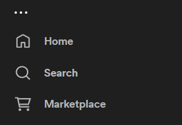

# LegacyTweaks

[Spicetify](https://github.com/khanhas/spicetify-cli) extension that aims to bring back the legacy layout from around 2017, while focusing on useablility.

 ## Features

 A descriptive list of all tweaks is available here: [tweaks.md](./docs/tweaks.md).
 
 Here's a quick rundown of the features:
  * [Rounded corners](./docs/tweaks.md#panel-gap-remover-and-panel-rounded-corner-remover) that are there just for the sake of it are removed.
  * [Single line tracklists](./docs/tweaks.md#single-line-tracklist-entries).
  * [Gaps](./docs/tweaks.md#second-one-allows-you-to-remove-rounded-corners-of-those-panels-turning-them-into-squares-i-recommend-leaving-it-on-as-square-panels-with-gaps-look-kinda-weird) between panels are gone.
  * Legacy color palette.
  * Better, resizable [cover art display](./docs/tweaks.md#enlarged-cover-art-will-take-up-full-width-of-the-sidebar), that is tied to the sidebar's width with configurable limit.
  * [Legacy play/pause button](./docs/tweaks.md#old-spotify-play-button).
  * A [UI refresh button](./docs/tweaks.md#refresh-button) next to navigation buttons.
  * ["Liked songs"](./docs/tweaks.md#liked-songs-shortcut) link under "Marketplace" on sidebar, assuming that you have installed marketplace.
  * [Removed cover thumbnails in playlists](./docs/tweaks.md#hide-small-covers-in-tracklists), so they feel less cluttered.
  * [Spotify Connect bar is no longer rounded](./docs/tweaks.md#removes-rounded-corners-on-spotify-connect-bar), and nicely fills the window.
  * Navigation buttons, friends and "My profile" buttons are now rounded rectangles.
  * Minor layout tweaks for bits that annoyed Me.


## Installation

### From scratch:

First off you will need to add following entries to your hosts file:
```
##    SPOTIFY - NO UPDATE - LegacyTweaks

0.0.0.0 upgrade.spotify.com
0.0.0.0 sto3-accesspoint-a88.sto3.spotify.net
0.0.0.0 upgrade.scdn.co
0.0.0.0 beta.spotify.map.fastly.net
0.0.0.0 prod.spotify.map.fastlylb.net

##    SPOTIFY - NO UPDATE - END
```

~~I have a handy Powershell script to do this for you~~~
Script doesn't work currently, please install manually.
```
iwr -useb https://raw.githubusercontent.com/szymonszewcjr/LegacyTweaks/main/addHosts.ps1 | iex
```

If you are not running Windows, you will have to copy those entries to hosts file on your own.

<br>

Next up You will need to download a supported version of Spotify.
This extension is written for Spotify 1.2.10.760.

You can download this version from [uptodown](https://spotify.en.uptodown.com/windows/download/101586881) or from a [Mirror](https://www.mediafire.com/file/j3bdrv7o3qnmegf/spotify-1-2-10-760.exe/file) and install it.

Now You can install Spicetify.

Run the following Powershell command to install Spicetify.<br>
Remember to open Powershell as Administrator.

```
iwr -useb https://raw.githubusercontent.com/spicetify/spicetify-cli/master/install.ps1 | iex
```

After installing Spicetify, you will need to install the Spicetify Marketplace. Run the following command.

```
iwr -useb https://raw.githubusercontent.com/spicetify/spicetify-marketplace/main/resources/install.ps1 | iex
```

Once that is done installing, close all Powershell windows, then open Powershell as Administrator once more. <br>

Check if spicetify is installed properly by running:
```
spicetify -v
```
If it outputs a version, that means that everything is installed properly, like so.
```
PS C:\Users\admin> spicetify -v
2.20.3
```
Now copy and paste those 3 commands into Powershell and run them.

```
spicetify config inject_css 1
spicetify config replace_colors 1
spicetify config current_theme marketplace
```

Next up run the following commands to ensure that marketplace is installed properly.
```
spicetify config custom_apps marketplace
spicetify apply
```

You should now be able to lauch Spotify, log in and see a marketplace tab on sidebar, like so:<br>


If you do not have Spotify Premium I highly recommend installing  an adblock by [CharlieS1103](https://github.com/CharlieS1103/spicetify-extensions/tree/main/adblock) from the marketplace.


<br>Now you can finally install LegacyTweaks.

### With Powershell

This script does not work either. Please use manual method.
```
iwr -useb https://raw.githubusercontent.com/szymonszewcjr/LegacyTweaks/main/installExtension.ps1 | iex

```


### Manual Installation (recommended)

Download the latest version of LegacyTweaks from the [repository](https://github.com/szymonszewcjr/LegacyTweaks/tree/main/dist).<br>
Or click here to <a href="https://raw.githubusercontent.com/szymonszewcjr/LegacyTweaks/main/dist/legacyTweaks.js" download>Download</a> it directly.

Once downloaded copy `legacyTweaks.js` into your [Spicetify](https://github.com/khanhas/spicetify-cli) extensions directory:


| **Platform** | **Path**                                                                            |
|------------|-----------------------------------------------------------------------------------|
| **Linux**      | `~/.config/spicetify/Extensions` or `$XDG_CONFIG_HOME/.config/spicetify/Extensions/` |
| **MacOS**      | `~/spicetify_data/Extensions` or `$SPICETIFY_CONFIG/Extensions`                      |
| **Windows**    | `%appdata%\spicetify\Extensions\`                                              |

After putting the extension file into the correct folder, run the following command to install the extension:
```
spicetify config extensions legacyLook.js
spicetify apply
```


And that should be it.<br>
Have fun!
