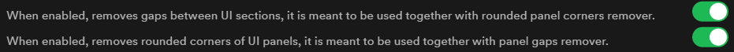
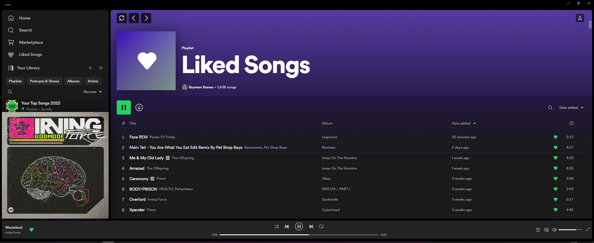
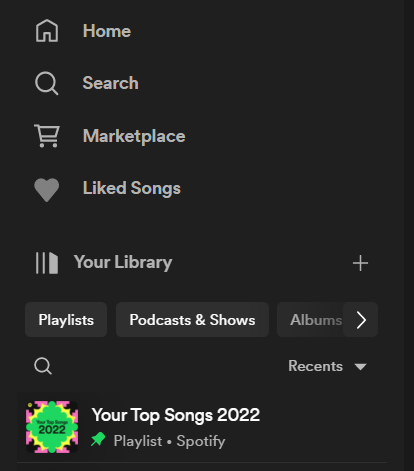

# Hello to LegacyTweaks 'docs' of sort

### This list has examples showcasing every available tweak, and it's functionality.
### Almost all tweaks are toggleable thru built-in Spotify settings.
### All right, lets break down all available tweaks one by one.

- [Shift playlist title 12px to the right](#shift-playlist-title-12px-to-the-right)
- [Enlarged cover art will take up full width of the sidebar](#enlarged-cover-art-will-take-up-full-width-of-the-sidebar)
- [Panel Gap Remover, and Panel Rounded Corner remover](#panel-gap-remover-and-panel-rounded-corner-remover)
- [Background Color Tweaks](#background-color-tweaks)
- ["My library" filters are less rounded](#my-library-filters-are-less-rounded)
- [Remove rounded corners from "My Library" entries](#remove-rounded-corners-from-my-library-entries)
- [Underscore tracklist entries](#underscore-tracklist-entries)
- [Underscore library entries](#underscore-library-entries)
- [Remove rounded corners in tracklist items](#remove-rounded-corners-in-tracklist-items)
- [Single line tracklist entries](#single-line-tracklist-entries)
- [Old Spotify Play Button](#old-spotify-play-button)
- [Remove expand library arrow](#remove-expand-library-arrow)
- [Carousel Buttons Tweak](#carousel-buttons-tweak)
- [Remove blank space between Liked Songs and My Library](#remove-blank-space-between-liked-songs-and-my-library)
- [Removes rounded corners on spotify connect bar](#removes-rounded-corners-on-spotify-connect-bar)

Refresh button, and Liked Songs buttons cannot be disabled.

 

## Refresh button:
[Go back up](#hello-to-legacytweaks-docs-of-sort)
***

Adds a simple UI reload button.
 

That's how it looks and does exactly what you think it does, refreshes UI. 
This tweak cannot be disabled.

  

## Liked Songs shortcut:
[Go back up](#hello-to-legacytweaks-docs-of-sort)
***

Adds a shortcut to "Liked Songs".

 

"Liked Songs" text is not localized, it will show as "Liked Songs", regardless of your language. 
This tweak cannot be disabled (yet).

  

## Shift playlist title 12px to the right:
[Go back up](#hello-to-legacytweaks-docs-of-sort)
***

 

This tweak is simple, it shifts playlist title 12px to the right. Just makes top bar feel less clutered.
Here's before and after.

#### Before:

#### After:

    

## Enlarged cover art will take up full width of the sidebar:

[Go back up](#hello-to-legacytweaks-docs-of-sort)
***

 

Stretches cover art container to fill up a full width of left sidebar. Has configurable max width also via settings, 420px is default.

#### This is how spotify looks out of the box:

#### And this is how it looks like after enabling the tweak:

## And the best part is: It dynamically resizes! See the video below.
 
<video src="./assets/dynamic_coverart-1.mp4" controls title="Dynamic Coverart resizing demo" autoplay loop muted playsinline></video>

    

## Panel Gap Remover, and Panel Rounded Corner remover:

[Go back up](#hello-to-legacytweaks-docs-of-sort)

 

### These two tweaks mostly work together, however you can disable either of them and see what will happen.
 

#### First one allows you to remove gaps between panels. 
#### Please note that the gaps will not be visible if you have enabled the tweak to change background color to gray.

 

#### Second one allows you to remove rounded corners of those panels, turning them into squares. I recommend leaving it on, as square panels with gaps look kinda weird.
 

### BEFORE:

***
 

### AFTER:

***

    

## Background Color Tweaks:

[Go back up](#hello-to-legacytweaks-docs-of-sort)
 

#### Those two settings allow you to change color scheme to similiar scheme that 2017 spotify had.

Extension currently has no support for custom colors, I may add it if there is a demand. 

If you want that feature, tell me by creating an issue.

 

### BEFORE:

***

 

### AFTER:

***

    

## Hide small covers in tracklists:

[Go back up](#hello-to-legacytweaks-docs-of-sort)

### This simple tweak hides covers in tracklists, playlists and queues.

#### Not everyone will like this change, you can disable it if you don't like it.
 

#### Note: This will not save you any data, Spotify will still waste bandwidth downloading all those covers, this tweak just hides them.

  

### BEFORE:

***

 

### AFTER:

***

    

## "My library" filters are less rounded:
[Go back up](#hello-to-legacytweaks-docs-of-sort)
  

This will be best shown with an ./assets/image, take a look.

### BEFORE:

***

### AFTER:

***

    

## Remove rounded corners from "My Library" entries:
[Go back up](#hello-to-legacytweaks-docs-of-sort)
  

### Bugged out, currently useless and better left off.
#### Will update this, when fixed.

This tweak is supposed to make items in "My Library" list square instead of rounded.  
Currently does not work at all. So you can safely ignore it and move on.

***

    

## Underscore tracklist entries:
[Go back up](#hello-to-legacytweaks-docs-of-sort)
  

 
 
This tweak underscores each song in tracklists, queues etc.
Makes it look more like 2017 Spotify.
Here's how it looks.

### BEFORE:

***

### AFTER:

***

    

## Underscore library entries:

[Go back up](#hello-to-legacytweaks-docs-of-sort)
  

 
 
Similiar to previous tweak, underscores library items instead.
Here's how it looks.

### BEFORE:

***

### AFTER:

***

    

## Remove rounded corners in tracklist items:
[Go back up](#hello-to-legacytweaks-docs-of-sort)
  

Removes rounded corners in each track row. Bit hard to see on the picture, but corners are now square when hovering.

### BEFORE:

***

### AFTER:

***

    

## Single line tracklist entries:
[Go back up](#hello-to-legacytweaks-docs-of-sort)
  

Track rows are more compact, allowing more of them to fit on screen. 
If you don't like the way it looks, feel free to disable it.

Here's a comparison.

### BEFORE:

***

### AFTER:

***

    

## Old Spotify Play Button:
[Go back up](#hello-to-legacytweaks-docs-of-sort)

  

Pretty selfexplainatory, see comparison below.

### BEFORE:

***

### AFTER:

***

    

## Remove expand library arrow:
[Go back up](#hello-to-legacytweaks-docs-of-sort)

  

Removes the expand library button, disable if you need this button for some reason.
### BEFORE:

***

### AFTER:

***

    

## Carousel Buttons Tweak:
[Go back up](#hello-to-legacytweaks-docs-of-sort)

  

Makes this button, that I conveniently hilighted below, rounded square instead of circular.

### BEFORE:

***

### AFTER:

***

    

## Remove blank space between Liked Songs and My Library:
[Go back up](#hello-to-legacytweaks-docs-of-sort)

  

Removes blank space between Liked Songs and My Library. Subtle but makes it look better.

### BEFORE:

***

### AFTER:

***
    

## Removes rounded corners on spotify connect bar:
[Go back up](#hello-to-legacytweaks-docs-of-sort)

  

Removes rounded corners on spotify connect bar to make it fill up screen corners. Again subtle but makes it look this much better.

### BEFORE:

***

### AFTER:

***
  

## Have fun
If you have any questions or problems, please create an issue.

Keep in mind that this extension only works with older versions of spotify.
It was developed on: Spotify for Windows; 1.2.10.760

You can grab this specific version right here [https://spotify.en.uptodown.com/windows/download/101586881](https://spotify.en.uptodown.com/windows/download/101586881)

#### If you haven't already installed the extension or have no idea how to do it, I have a installation guide right here [readme.md](../readme.md)